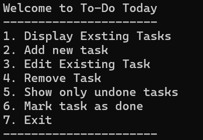

WELCOME TO PYTHON TO-DO APP!

## Key Features

To-Do List is desing to keep you organised. With features like:
- Add ToDo
- Edit Existing ToDo
- Show All ToDos
- Show undone ToDos
- Mark as Done
- Delete ToDo

Application feature numberous option, each with clear prompt what user should do next, and roboust input validation and error handling. 

## How to run
If you are running repository from your device:

1. Download and unzip folder. 

2. Open folder in Visual Studio Code and open folder in it.

3. To run project, in terminal input:

python main.py

If you are running with use of Git:

1. Clone the repository:

git clone https://github.com/KatBaginska/Python-ToDo-List.git

2. Navigate to the folder:

cd Python-ToDo-List

3. Run the program:

python main.py